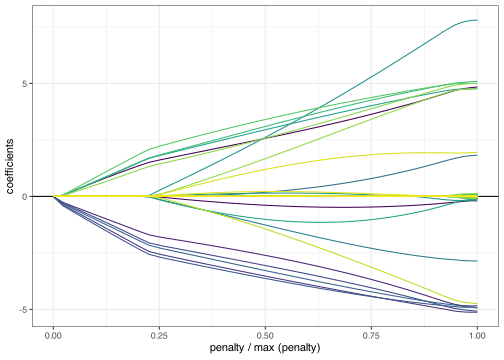

<!-- badges: start -->
[](https://github.com/dajmcdon/sparsegl/actions)[](https://CRAN.R-project.org/package=sparsegl)
<!-- badges: end -->

<!-- README.md is generated from README.Rmd. Please edit that file -->

# sparsegl <a href="https://dajmcdon.github.io/sparsegl/"></a>

The goal of sparsegl is to fit regularization paths for sparse
group-lasso penalized learning problems. The model is typically fit for
a sequence of regularization parameters $\lambda$. Such estimators
minimize

$$
-\ell(\beta | y,\ \mathbf{X}) + \lambda(1-\alpha)\sum_{g\in G} \lVert\beta_g\rVert_2 + \lambda\alpha \lVert\beta\rVert_1.
$$

The main focus of this package is for the case where the loglikelihood
corresponds to Gaussian or logistic regression. But we also provide the
ability to fit arbitrary GLMs using `stats::family()` objects. Details
may be found in Liang, Cohen, Sólon Heinsfeld, Pestilli, and McDonald
([2024](#ref-sparsegl)).

## Installation

You can install the released version of sparsegl from
[CRAN](https://CRAN.R-project.org) with:

``` r
install.packages("sparsegl")
```

You can install the development version from
[GitHub](https://github.com/) with:

``` r
# install.packages("remotes")
remotes::install_github("dajmcdon/sparsegl")
```

## Minimal Example

``` r
set.seed(1010)
n <- 100
p <- 200
X <- matrix(data = rnorm(n * p, mean = 0, sd = 1), nrow = n, ncol = p)
eps <- rnorm(n, mean = 0, sd = 1)
beta_star <- c(
  rep(5, 5), c(5, -5, 2, 0, 0),
  rep(-5, 5), c(2, -3, 8, 0, 0), rep(0, (p - 20))
)
y <- X %*% beta_star + eps
groups <- rep(1:(p / 5), each = 5)
fit1 <- sparsegl(X, y, group = groups)
plot(fit1, y_axis = "coef", x_axis = "penalty", add_legend = FALSE)
```



## References

<div id="refs" class="references">

<div id="ref-sparsegl">

Liang, X., Cohen, A., Sólon Heinsfeld, A., Pestilli, F., and McDonald,
D.J. 2024. “sparsegl: An `R` Package for Estimating Sparse Group Lasso.”
*Journal of Statistical Software* 110(6), 1–23.
<https://doi.org/10.18637/jss.v110.i06>.

</div>

</div>
