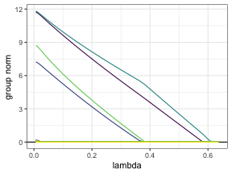
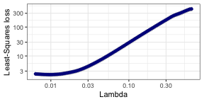
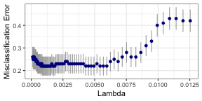
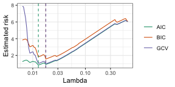
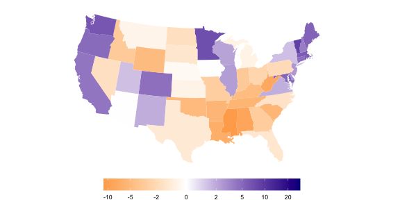
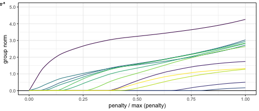

```r
# _Note on replication_
#
# This file will reproduce all results, but downloading the large brain data
# and running the timing simulation at the beginning takes some time/memory.
# For this reason, we have provided the results of these experiments in
# `large-data.zip`. The reproduction code is commented out, while the
# `large-data.zip` file is expected to be extracted in the same directory as
# this script.


# Necessary packages
# install.packages(c("knitr", "ggplot2", "tibble", "SGL", "dplyr", "covidcast"))
# install.packages(c("scales", "tidyr))
#
```


```
## 
## Attaching package: 'dplyr'
```

```
## The following objects are masked from 'package:stats':
## 
##     filter, lag
```

```
## The following objects are masked from 'package:base':
## 
##     intersect, setdiff, setequal, union
```


```r
## install.packages("sparsegl")
```

```r
set.seed(1010)
n <- 100
p <- 200
X <- matrix(rnorm(n*p), nrow = n, ncol = p)
beta <- c(
  rep(5, 5), c(5, -5, 2, 0, 0), rep(-5, 5), c(2, -3, 8, 0, 0),
  rep(0, (p - 20))
)
groups <- rep(1:(p / 5), each = 5)
eps <- rnorm(n, mean = 0, sd = 1)
y <- X %*% beta + eps
pr <- 1 / (1 + exp(-X %*% beta))
y0 <- rbinom(n, 1, pr)
```


```r
fit <- sparsegl(X, y, group = groups)
```

```r
plot(fit, y_axis = "coef", x_axis = "penalty", add_legend = FALSE)
plot(fit, y_axis = "group", x_axis = "lambda", add_legend = FALSE)
```



```r
coef(fit, s = c(0.02, 0.03))[c(1,3,25,29),] # display a few
```

```
## 4 x 2 sparse Matrix of class "dgCMatrix"
##                      1         2
## (Intercept) -0.0478063 -0.166029
## V2           4.7130338  4.637027
## V24          .          .       
## V28          .          .
```

```r
predict(fit, newx = tail(X), s = fit$lambda[2:3])
```

```
##                1         2
##  [95,] -3.984822 -2.995212
##  [96,] -3.993392 -3.022298
##  [97,] -4.119941 -4.182029
##  [98,] -4.154898 -4.469452
##  [99,] -4.154060 -4.402944
## [100,] -4.091476 -3.992535
```

```r
print(fit)
```

```
## 
## Call:  sparsegl(x = X, y = y, group = groups) 
## 
## Approx. degrees of freedom:  0  -  113 
## Range of lambda:  0.636  -  0.006 
## Saturated penalty:  41.032
```

```r
cv_fit <- cv.sparsegl(X, y, groups, nfolds = 15)
plot(cv_fit)
```



```r
coef(cv_fit, s = "lambda.1se")[c(1,3,25,29),]
```

```
## (Intercept)          V2         V24         V28 
## 0.005944379 4.741056120 0.000000000 0.000000000
```

```r
predict(cv_fit, newx = tail(X), s = "lambda.min")
```

```
##                 1
##  [95,]  11.380497
##  [96,]  39.968928
##  [97,]   4.627412
##  [98,] -34.819903
##  [99,]  -6.604000
## [100,] -16.133421
```

```r
fit_logit <- sparsegl(X, y0, groups, family = "binomial")
cv_fit_logit <- cv.sparsegl(
  X, y0, groups, family = "binomial", pred.loss = "misclass"
)
plot(cv_fit_logit, log_axis = "none")
```



```r
er <- estimate_risk(fit, X)
```





```
## R version 4.2.0 (2022-04-22)
## Platform: aarch64-apple-darwin20 (64-bit)
## Running under: macOS Monterey 12.5
## 
## Matrix products: default
## LAPACK: /Library/Frameworks/R.framework/Versions/4.2-arm64/Resources/lib/libRlapack.dylib
## 
## locale:
## [1] en_US.UTF-8/en_US.UTF-8/en_US.UTF-8/C/en_US.UTF-8/en_US.UTF-8
## 
## attached base packages:
## [1] stats     graphics  grDevices utils     datasets  methods   base     
## 
## other attached packages:
## [1] sparsegl_0.3.0 dplyr_1.0.9    tidyr_1.2.0    ggplot2_3.3.6 
## 
## loaded via a namespace (and not attached):
##  [1] Rcpp_1.0.9         RSpectra_0.16-1    RColorBrewer_1.1-3
##  [4] highr_0.9          pillar_1.8.0       compiler_4.2.0    
##  [7] tools_4.2.0        digest_0.6.29      covidcast_0.4.2   
## [10] dotCall64_1.0-1    viridisLite_0.4.0  evaluate_0.15     
## [13] lifecycle_1.0.1    tibble_3.1.8       gtable_0.3.0      
## [16] lattice_0.20-45    pkgconfig_2.0.3    rlang_1.0.4       
## [19] Matrix_1.4-2       cli_3.3.0          DBI_1.1.2         
## [22] rstudioapi_0.13    mapproj_1.2.8      xfun_0.31         
## [25] withr_2.5.0        stringr_1.4.0      knitr_1.39        
## [28] maps_3.4.0         generics_0.1.3     vctrs_0.4.1       
## [31] rprojroot_2.0.3    grid_4.2.0         tidyselect_1.1.2  
## [34] glue_1.6.2         here_1.0.1         R6_2.5.1          
## [37] fansi_1.0.3        farver_2.1.1       purrr_0.3.4       
## [40] magrittr_2.0.3     ellipsis_0.3.2     scales_1.2.0      
## [43] assertthat_0.2.1   colorspace_2.0-3   labeling_0.4.2    
## [46] utf8_1.2.2         stringi_1.7.8      MMWRweek_0.1.3    
## [49] munsell_0.5.0      crayon_1.5.1
```

